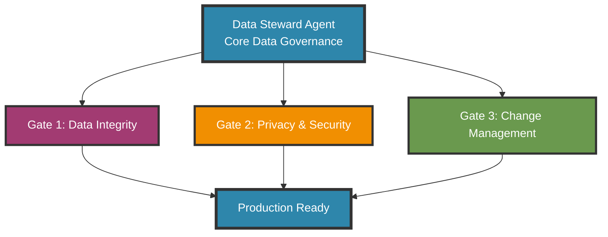

# Data Steward Agent for SaaS Products


**Version 1.0 — October 2025**  
*Essential Data Governance Framework for SaaS*  
By [Skylark 118 LLC](https://skylark118.com)

---

## Overview

The **Data Steward Agent** is an essential data governance framework for SaaS products - focused on what actually matters.

Most data governance frameworks are either too enterprise (500-page compliance manuals) or too vague (generic checklists). This framework gives you the **essential 20% that delivers 80% of the value**.

**This is not a "best practices list."**  
It's a **blocking governance agent**: no feature ships until data governance is validated.

---

## Framework Overview

**3 Core Gates**:
1. **Data Integrity** - Quality, consistency, documentation
2. **Privacy & Security** - PII protection, legal basis, deletion
3. **Change Management** - Schema control, migrations, rollback



---

## Built For

- Early-stage SaaS products needing governance from day 1
- Technical founders who want to get it right from the start
- Teams expanding to EU/California markets (GDPR/CCPA compliance)
- Products handling user data that need clear privacy practices

---

## What You Get

- Data quality validation (required fields, referential integrity)
- PII inventory with legal basis documentation
- Tested deletion capability (GDPR/CCPA compliance)
- Schema change control with rollback scripts
- Clear deliverables for each gate

**Time to basic implementation**: 4 weeks

---

## Quick Start

1. Read the [Core Framework](docs/core-data-steward-agent.md)
2. Follow the [4-Week Implementation Guide](docs/implementation-guide.md)
3. Copy templates and customize for your product:
   - [PII Inventory Template](templates/pii-inventory.yml)
   - [Schema Change Template](templates/schema-change-template.md)
   - [Deletion Test Checklist](templates/deletion-test-checklist.md)
4. Run [Validation Queries](scripts/validation-queries.sql)
5. See [Real-World Example](docs/examples/skylark-care-board-example.md)

---

## Repository Contents

```
data-governance-framework/
├── docs/
│   ├── core-data-steward-agent.md          # Complete framework specification
│   ├── implementation-guide.md              # 4-week implementation plan
│   └── examples/
│       └── skylark-care-board-example.md    # Real-world case study
├── templates/
│   ├── pii-inventory.yml                    # Track all personal data
│   ├── schema-change-template.md            # Document database changes
│   ├── deletion-test-checklist.md           # Verify GDPR compliance
│   └── data-dictionary-template.md          # Document your schema
└── scripts/
    └── validation-queries.sql               # SQL for all 3 gates
```

---

## Why This Matters

Every SaaS product eventually faces data governance failures:

- Bad data quality → Broken analytics and reporting
- Missing privacy controls → Regulatory fines (GDPR: up to 4% revenue)
- No deletion capability → Legal liability
- Uncontrolled schema changes → Production outages

**This framework prevents these failures.**

It's built from real-world implementation in a multi-tenant SaaS product handling sensitive health data. Not theory - practice.

---

## When to Expand Beyond Core

Start with these 3 gates. Add enterprise features only when needed:

- **Performance Monitoring** → When queries regularly exceed 1 second
- **Advanced Backup/DR** → When preparing for compliance audits  
- **Detailed Audit Logging** → When tracking sensitive data access required
- **Quarterly Compliance Reviews** → When regulations require formal audits

The framework is designed to grow with your product.

---

## Implementation Results

After 4 weeks of implementation in Skylark Care Board:

- 0 orphaned records
- 100% required field completion
- 0 invalid data formats
- Complete PII inventory with legal basis
- GDPR deletion capability validated
- 5 schema changes executed safely with 0 rollbacks

See the [complete case study](docs/examples/skylark-care-board-example.md).

---

## Consulting & Implementation Services

This framework is open-source and free to use.

**Need help implementing it?**

I work with SaaS companies to customize and implement this framework:

- Adapt validation gates for your specific tech stack
- Integrate governance into CI/CD pipelines  
- Prepare for GDPR/CCPA/HIPAA compliance audits
- Train teams on data governance practices

**Ideal for**:
- SaaS companies preparing for Series A+ fundraising
- Teams expanding to EU/California markets
- Products handling sensitive data (health, finance, children)
- Technical product leaders wanting enterprise-grade standards

[Schedule a consultation](https://skylark118.com) 

---

## Contributing

Improvements welcome! Please:
1. Keep the framework focused (resist feature bloat)
2. Prioritize practicality over comprehensiveness  
3. Include working examples with PRs

See [CONTRIBUTING.md](CONTRIBUTING.md) for details.

---

## License

MIT License - use freely in your projects.

See [LICENSE](LICENSE) for full text.

---

## Acknowledgments

This framework distills lessons from implementing data governance in production SaaS products, with emphasis on GDPR/CCPA compliance, multi-tenant architecture, and sustainable development practices.

Built with real-world validation, not enterprise theory.

---

**Questions?** Open an issue or reach out via [LinkedIn](https://www.linkedin.com/in/yourprofile)
