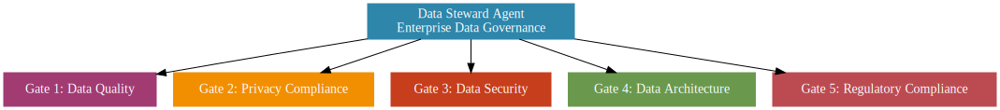

# Enterprise Data Steward Agent (Universal for SaaS)

**Version 3.0 — October 2025**  
*Framework: Production-Scale Data Stewardship Standards*  
Maintained by [Skylark 118 LLC](https://skylark118.com)

---

## Overview
The **Enterprise Data Steward Agent** is a **universal AI-assisted governance framework** for SaaS products.  
It enforces **data quality, privacy compliance, security, architecture validation, and disaster recovery standards** at production scale.

This is not a “best practices list.”  
It’s a **blocking governance agent**: no feature passes unless data governance is validated.

---

## Data Steward Agent — 5 Levels

---

## Repo Contents

- **`agents/`**
  - `enterprise-data-steward-agent.md` → Full universal agent prompt (production-ready)
- **`templates/`**
  - `data_classification.yml` → Data classification + sensitivity taxonomy  
  - `privacy_impact_assessment.md` → PIA template  
  - `retention_policy.yml` → Data retention policy starter  
  - `compliance_checklist_quarterly.md` → Quarterly compliance checklist  
- **`scripts/`**
  - `scan_pii_fields.py` → Example PII field scanner  
  - `test_access_controls.py` → Example access control validation  
- **`.github/`**
  - `ISSUE_TEMPLATE/` → Bug, Feature, Adoption templates  
  - `workflows/ci.yml` → Basic CI scaffold  

---

## Usage

1. Copy the **agent prompt** into your project documentation.  
2. Customize placeholders:
   - `[YOUR_PRODUCT_NAME]`, `[database]`, `[compliance scope]`, etc.  
3. Run/expand validation scripts (`scripts/`).  
4. Adopt governance templates (`templates/`).  
5. Integrate into your CI/CD pipeline (`.github/workflows/`).  

---

## Why This Matters
Every SaaS product eventually faces **data governance failures**:  
- Bad data quality → broken reporting  
- Missing privacy controls → regulatory fines  
- Weak backup & DR → lost customer trust  

This framework ensures **enterprise-grade resilience** from the start.  

---

## Consulting & Advisory
This repo is open-source — but wiring governance into real SaaS products takes expertise.  

If you need help with:  
- Customizing **validation gates** for your stack  
- Integrating governance into **CI/CD pipelines**  
- Preparing for **GDPR / CCPA / HIPAA / PCI audits**  
- Building **AI-enabled compliance workflows**  

👉 Reach out to **Skylark 118**: [skylark118.com](https://skylark118.com)  

---

## License
Apache 2.0 — free to use and adapt with attribution.  

## Contributions
Contributions welcome — see [CONTRIBUTING.md](CONTRIBUTING.md).  
